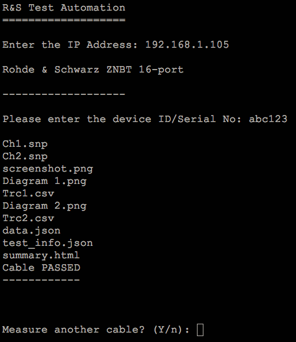
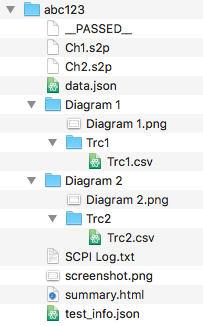

R&S Test Automation
===================

Connects to a Rohde & Schwarz Vector Network Analyzer (VNA), runs all sweeps, then saves all relevant data.

Screenshots
-----------

### In GUI mode


### In command-line mode



Skew and Propagation Delay
--------------------------

Skew and propagation delay calculations are triggered off diagram keywords.

The script searches for the following phrases (case insensitive) in the title:

- `skew`
- `prop delay`
- `prop. delay`
- `propagation delay`

Results
-------

Test data can be found in the `~/Documents/TestAutomation` folder, organized by serial number.



Saved data includes:

- Overall screenshot
- Touchstone files (1 per channel, ports used in trace)
- Global pass/fail (json)
- Per diagram pass/fail
- Diagram images
- Trace data (csv)
- Marker positions and values (json)
- Skew, propagation delay (if indicated, json)
- Summary report (html)
- SCPI command log (for debugging)

Binary Installers
-----------------

Installers can be found for Windows x64 and MacOS 10.12 or later [here](https://vna.rs-us.net/applications/test_automation.html).

Building from source
--------------------

### Requirements

- Python 3.5+
- Node 6.9+
- Ruby 2.2+
- Bundler Ruby gem

The following packages and modules are primarily used:

The python [rohdeschwarz](https://github.com/Terrabits/rohdeschwarz) package is used to control the VNA.

[wheezy.template](https://pypi.python.org/pypi/wheezy.template) is used to generate the `summary.html` for each test on-the-fly.

[Middleman 4](https://middlemanapp.com/) is used to generate the static ui files (html, css, js).

[electron](http://electron.atom.io/) is used to host the html/css/js ui. Node is used to orchestrate the tests in python via `child_process`es.

[electron-builder](https://github.com/electron-userland/electron-builder) is used to create a distributable / installer.

### Install

Assuming Python 3.5+, Node 6.9+ and Ruby 2.2+ are installed, you can get setup from the command line with:

```bash
cd path/to/project
pip install -r requirements.txt
npm install
gem install bundler
bundle install
```

### npm tasks

The following scripts are available from the command line:

#### Build `gui` source with Middleman

`npm run build-mm`

#### Build python code with pyinstaller

`npm run build-py`

#### Pack and distribute

The following commands assume the python and gui sources have been built successfully.

To pack files into a single folder (`dist/*-unpacked`):

`npm run pack`

To create a distributable installer:

`npm dist`

See the [electron-builder](https://github.com/electron-userland/electron-builder) project for more details on how the installer is generated.

#### From the command line

If you'd prefer, you can separate out the user interface (node, electron, ruby, middleman) and stick to python and the command line. In that case, you only need the following sources:

- `rstest/`
- `test/` (optional)
- `run.py`
- `requirements.txt`
- `run.spec`

The `run.py` script has the following modes of operation:

##### With no args

`run.py`

The script will measure repeatedly, based on user input. See the command line screenshot above.

##### Test VNA connection

`run.py <ip address>`

If you execute the run.py script with the IP address as a command line argument, the script will attempt to connect to the VNA and report back whether or not it could connect. If connected, you will get a printout with instrument information.

##### Measure one DUT

`run.py <ip address> <serial no>`

With this command line structure the script will measure a single DUT then exit.
